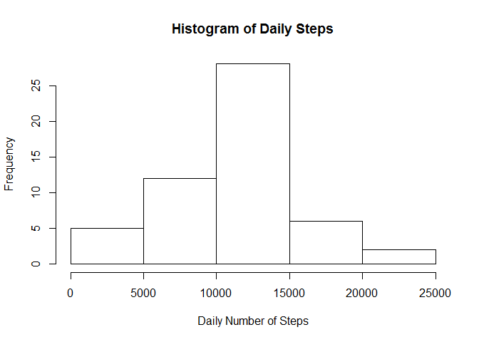
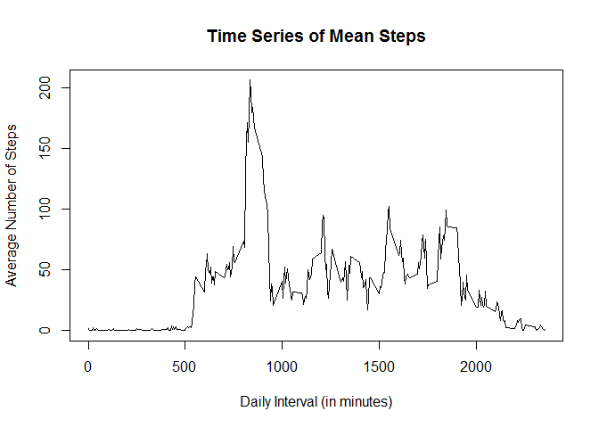
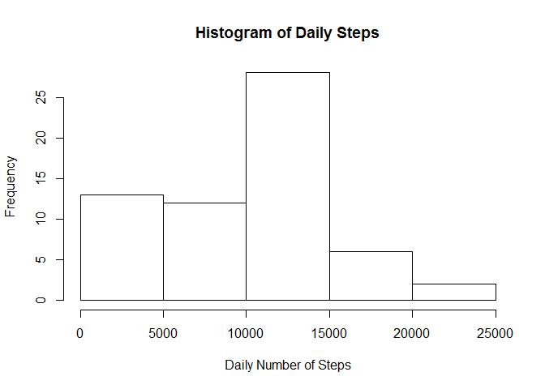
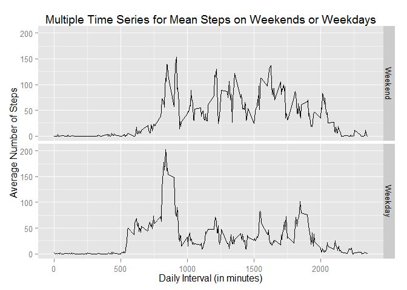

#Assignment#

This first assignment will be described in multiple parts: a) loading data, b) mean and median steps taken daily, c) average daily activity pattern, d) imputation of missing values, and e) differences in activity pattern between weekends and weekdays. 

##Loading Data## 
Source Dataset: activity.csv (2/11/2014 10:08AM)

[Activity monitoring data](https://d396qusa40orc.cloudfront.net/repdata%2Factivity.zip) 

Three variables are included in the activity monitoring dataset: 
1. **steps** taken in a 5-minute interval (missing values are coded as NA),
2. **date** on which a measurement was taken in YYYY-MM-DD format, and
3. **interval** in which a measurement was taken.

##Interpretation of Results##

Descriptive statistics, means and medians, for non-missing daily steps (excluding missing values) and total daily steps (including missing values) are lower when 2,304 missing values are imputed as zeroes. 

Number of Observations    Mean Daily Steps  Median Daily Steps
----------------------    ----------------  ------------------
Non-missing   15,264          10,766              10,765
Missing        2,304
Total         17,568           9,354              10,400

Since 11,014 of the non-missing values equal zero, the total number of zero step counts is 13,318.

##List of Figures##

Histograms for the mean number of steps taken daily allow graphical comparison of frequency distributions excluding and including (imputed) missing values. 

Time series of mean number of steps taken per five-minute interval allow graphical comparison of time series for weekend 

- Rplot1. Histogram of total number of steps taken daily excluding missing values
- Rplot2. Time series of mean number of steps taken per five-minute interval averaged over days,
- Rplot3. Histogram of total number of steps taken daily including imputed missing values, 
- Rplot4. Multiple time series of mean number of steps taken per five-minute interval averaged over weekends or weekdays.


```r
setwd("C:/Users/d2i2k/RepData_PeerAssessment1")
ActivityData <- read.csv("activity.csv", header=TRUE) 
x <- tapply(ActivityData$steps,INDEX=ActivityData$date,FUN=sum,na.rm=TRUE)
y <- subset(x, x>0)
```

**Rplot1. Histogram of total number of steps taken daily (excluding missing values)**
 

**Mean and median number of steps taken daily (excluding missing values)**

```r
summary(y)
```

```
##    Min. 1st Qu.  Median    Mean 3rd Qu.    Max. 
##      41    8840   10800   10800   13300   21200
```

```r
x <- tapply(ActivityData$interval,INDEX=ActivityData$interval,FUN=mean,na.rm=TRUE)
y <- tapply(ActivityData$steps,INDEX=ActivityData$interval,FUN=mean,na.rm=TRUE)
xy <- cbind(x,y)
```

**Rplot2. Time series of mean steps taken per five-minute interval averaged over days**
 

**Maximum number of steps taken per five-minute interval (peak activity equals 206 steps during the 104th five-minute interval @ 835 minutes)**

```r
which.max(y)
```

```
## 835 
## 104
```

###Strategy for data imputation of missing values as zeroes###

```r
setwd("C:/Users/d2i2k/RepData_PeerAssessment1")
ActivityData <- read.csv("activity.csv", header=TRUE) 
x <- is.na(ActivityData$steps)
x.sub <- subset(x,x="TRUE")
length(x.sub)
```

```
## [1] 2304
```

```r
y <- ifelse(is.na(ActivityData$steps),0,ActivityData$steps)
z <- data.frame(y,ActivityData$date)
w <- tapply(z$y,INDEX=z$ActivityData.date,FUN=sum,na.rm=TRUE)
```

**Rplot3. Histogram of total number of steps taken daily (including imputed missing values)**
 

**Mean and median number of steps taken daily (including imputed missing values)**

```r
summary(w)
```

```
##    Min. 1st Qu.  Median    Mean 3rd Qu.    Max. 
##       0    6780   10400    9350   12800   21200
```

###Repeat strategy for data imputation of missing values as zeroes###

```r
x <- ifelse(is.na(ActivityData$steps), 0, ActivityData$steps)  # 17,568 row vector
y <- ActivityData$interval                                     # 17,568 row vector
```

###Factor variable for weekends (Sat-Sun) versus week days (Mon-Fri)###

```r
library(chron)
```

```
## Warning: package 'chron' was built under R version 3.0.3
```

```r
w <- is.weekend(ActivityData$date)                             # 17,568 row vector
xyw <- data.frame(x,y,w)                                       # 17,568 row by 3 column array
xyw1 <- subset(xyw,w=="TRUE")                                  #  4,608 row by 3 column array for weekends
x <- tapply(xyw1$x,INDEX=xyw1$y,FUN=mean,na.rm=TRUE)           #    288 row vector of steps
y <- tapply(xyw1$y,INDEX=xyw1$y,FUN=mean,na.rm=TRUE)           #    288 row vector of intervals
z <- vector(mode = "character",length=288)                     #    288 row vector of weekends
   for (i in 1:288) {z[i] <- "Weekend"}
xy1 <- cbind(as.data.frame(x),as.data.frame(y),as.data.frame(z))    #    288 row by 3 column array for weekends

xyw2 <- subset(xyw,w=="FALSE")                                 #  4,608 row by 3 column array for weekdays
x <- tapply(xyw2$x,INDEX=xyw2$y,FUN=mean,na.rm=TRUE)           #    288 row vector of steps
y <- tapply(xyw2$y,INDEX=xyw2$y,FUN=mean,na.rm=TRUE)           #    288 row vector of intervals
z <- vector(mode = "character",length=288)                     #    288 row vector of weekdays
   for (i in 1:288) {z[i] <- "Weekday"}
xy2 <- cbind(as.data.frame(x),as.data.frame(y),as.data.frame(z))    #    288 row by 3 column array for weekdays

xy <- rbind(xy1,xy2)                                           #    576 row by 3 column array
```

**Rplot4. Multiple time series of mean steps taken per five-minute interval averaged over weekends or weekdays**

```
## Warning: package 'ggplot2' was built under R version 3.0.3
```

 
